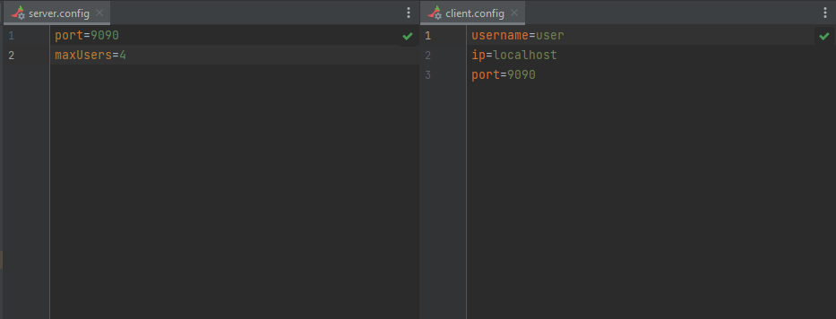

# Ulak
## Simple Messaging Application

Practice on:
* Maven Project
* JavaFX
* Concurrency
* TCP

### How to run

* Install javafx sdk
* Add env variable FX_HOME with javafx sdk
* Create package project with `mvn package`
* Start the Server with `startServer.bat`
* Start the Server with `startClient.bat`

## Screenshots

